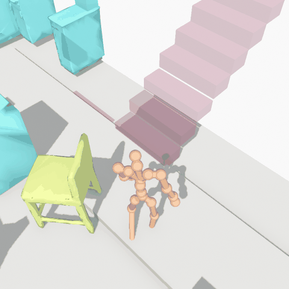
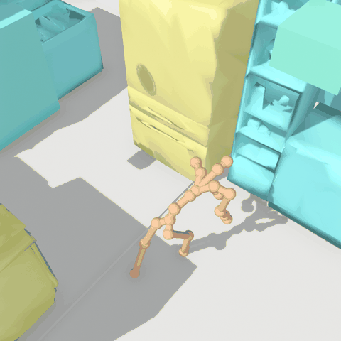
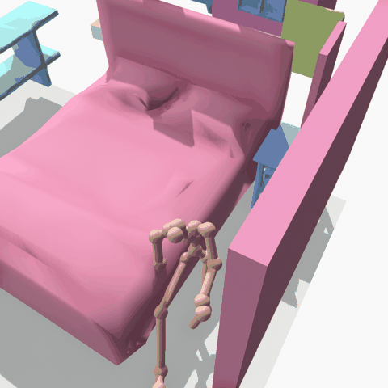
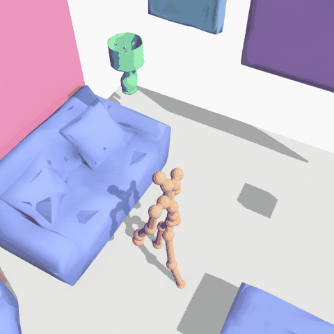
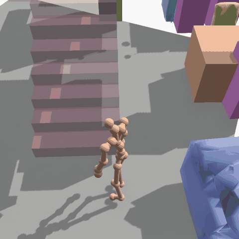
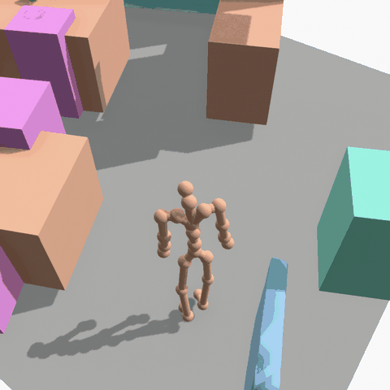

# Human Motion Generation from Text, Scene and Trajectory

Autoregressive rollouts on held-out test-split segments, conditioned on text, scene, and goal:

| | | |
|---|---|---|
|  |  |  |
| Cooking | Fridge | Laying Down |
|  |  |  |
| Sitting | Stairs | Walking |

Ablations on a synthetic scene, varying the classifier-free guidance scale of each condition from 0.0 to 3.0 in isolation:

| | |
|---|---|
|  |  |
| Text Ablation | Goal Ablation |
|  |  |
| Scene Ablation | No-Obstacle Scene Ablation |

## Setup

```bash
git clone <repository-url>
cd nymeria_plus_motion
pip install -e ".[download,preprocess]"
```

## Data Preparation

To download and preprocess the dataset (requires SMPL models):
```bash
# 1. Download
python -m src.datasets.nymeriaplus.download \
  --url-json /path/to/urls.json \
  --output data/nymeriaplus/download \
  --fps 10

# 2. Preprocess
python -m src.datasets.nymeriaplus.preprocess \
  --input data/nymeriaplus/download \
  --output data/nymeriaplus \
  --smpl-male-model /path/to/smpl/male.pkl \
  --smpl-female-model /path/to/smpl/female.pkl
```

## Training

```bash
# Pre-cache text features
for encoder in clip bert t5; do
  python -m src.cache --dataset data/nymeriaplus --text-encoder $encoder --split all --max-text-tokens 64
done

# Train
python -m src.train --config configs/default.yaml --name main_run --workers 4
```

## Tests

```bash
# Overfit on a single batch to test the pipeline
python -m src.train --config configs/overfit_test.yaml --name overfit_run
```

## Demo

```bash
python -m demo.demo \
  --config runs/main_run/config.yaml \
  --checkpoint runs/main_run/checkpoints/main_run_epoch300.pth
```

## Directory Structure

```text
nymeria_plus_motion/
├── configs/                  # Yaml configuration files
├── demo/                     # Interactive demo tool & visualizer
├── docs/                     # Detailed technical and dataset documentation
├── pyproject.toml            # Project dependencies and packaging setup
├── README.md                 # Project guide (this file)
└── src/                      # Source package
    ├── cache.py              # Text feature pre-caching script
    ├── config.py             # Configuration loader
    ├── inference.py          # Auto-regressive rollout state & generation engine
    ├── train.py              # Model training script
    ├── datasets/             # Dataset implementations (Nymeria Plus)
    ├── models/               # Model architectures (Transformer, Encoders)
    └── utils/                # Geometry, scene, and statistics helpers
```
