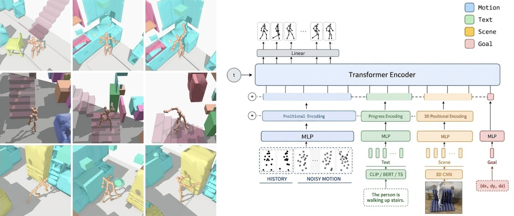

# Human Motion Generation from Text, Scene, and Trajectory on NymeriaPlus

[**Paper**](docs/paper/main.pdf) &nbsp;|&nbsp; [**Project Page**](https://lucaspilla.github.io/3d-scanning-and-spatial-learning/)



## Setup

```bash
git clone https://github.com/LucasPilla/3d-scanning-and-spatial-learning.git
cd 3d-scanning-and-spatial-learning
pip install -e ".[download,preprocess]"
```

## Data Preparation

Requires SMPL models.

```bash
# 1. Download
python -m src.datasets.nymeriaplus.download \
  --url-json /path/to/urls.json \
  --output data/nymeriaplus/download \
  --fps 10

# 2. Preprocess
python -m src.datasets.nymeriaplus.preprocess \
  --input data/nymeriaplus/download \
  --output data/nymeriaplus \
  --smpl-male-model /path/to/smpl/male.pkl \
  --smpl-female-model /path/to/smpl/female.pkl
```

## Training

```bash
# Pre-cache text features
for encoder in clip bert t5; do
  python -m src.cache --dataset data/nymeriaplus --text-encoder $encoder --split all --max-text-tokens 64
done

# Train
python -m src.train --config configs/default.yaml --name main_run --workers 4
```

## Evaluation

```bash
python -m src.test --config runs/main_run/config.yaml --checkpoint runs/main_run/checkpoints/main_run_epoch300.pth
```

## Demo

```bash
python -m demo.demo \
  --config runs/main_run/config.yaml \
  --checkpoint runs/main_run/checkpoints/main_run_epoch300.pth
```

## Directory Structure

```text
.
├── assets/     # README teaser image
├── configs/    # YAML configuration files
├── demo/       # Interactive demo tool & visualizer
├── docs/       # Paper source/PDF, slides
├── legacy/     # Compatibility shim for pre-token-redesign (v1) checkpoints
└── src/        # Source package
    ├── cache.py       # Text feature pre-caching
    ├── config.py      # Configuration loader
    ├── inference.py   # Autoregressive rollout state & generation engine
    ├── train.py       # Training script
    ├── test.py        # Test-set evaluation script
    ├── datasets/      # NymeriaPlus dataset implementation
    ├── models/        # Transformer denoiser & condition encoders
    └── utils/         # Geometry, scene, and statistics helpers
```

## Citation

```bibtex
@misc{pimentel2026humanmotion,
  author = {Pimentel, Lucas Pilla},
  title  = {Human Motion Generation from Text, Scene, and Trajectory on NymeriaPlus},
  year   = {2026},
  note   = {Technical University of Munich},
  url    = {https://github.com/LucasPilla/3d-scanning-and-spatial-learning}
}
```
