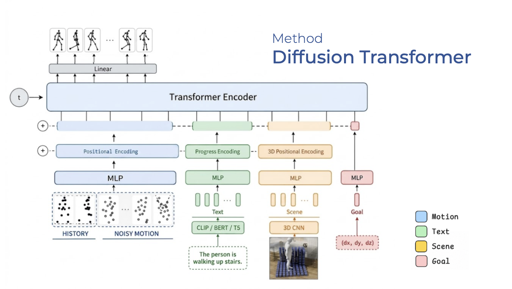
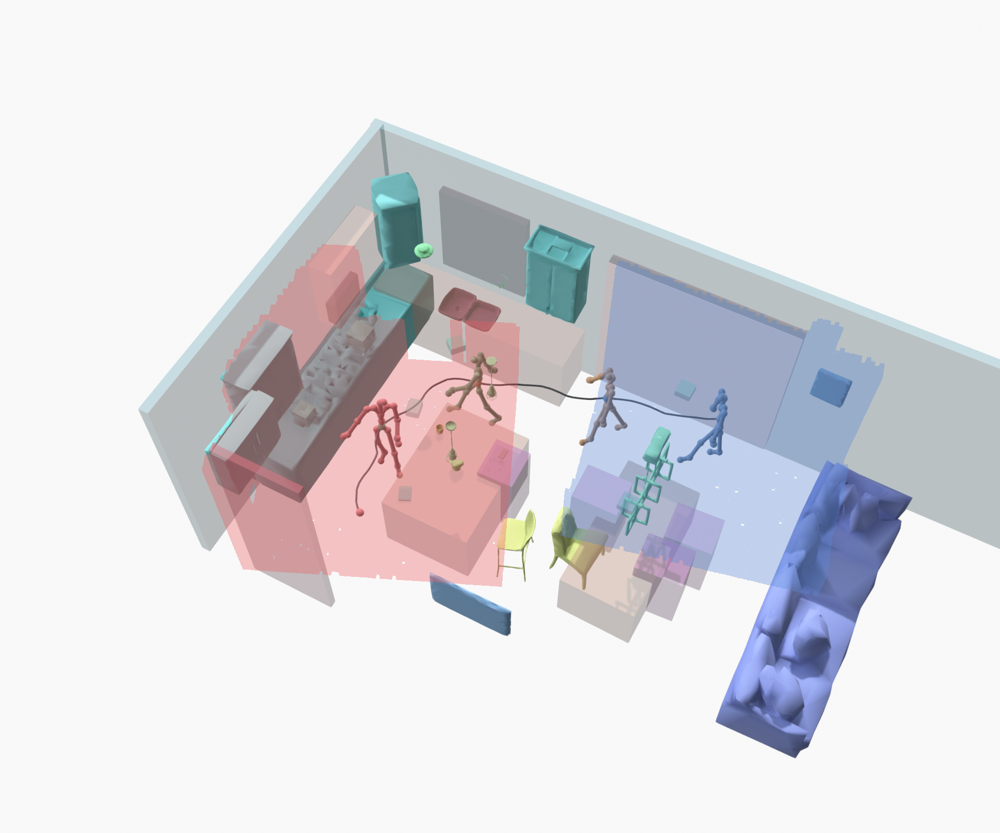
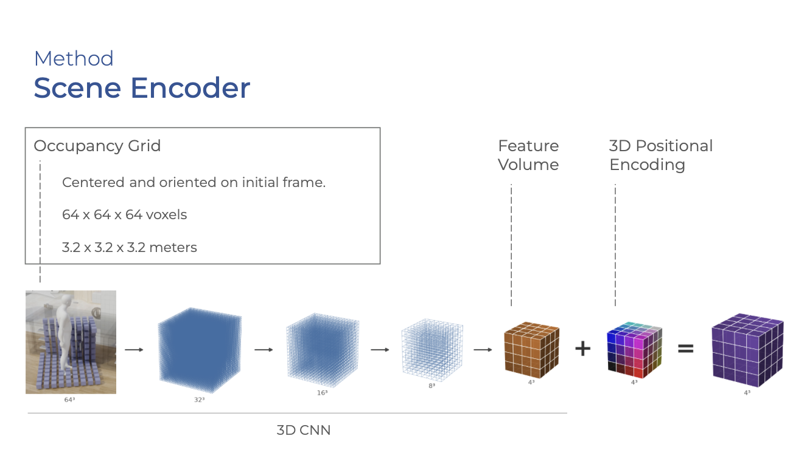

# Architecture

## 1. Diagram

## 2. Condition Encoders

### Text Encoder

Text tokens are generated using a frozen language model (e.g., CLIP, DistilBERT, or T5). The raw text string is tokenized, passed through the pre-trained model, and the resulting dense hidden states are projected into the transformer's dimension. 

### Scene Encoder

### Goal

The goal is the anchor-local pelvis position `(dx, dy, dz)`. It is by construction the same physical quantity as channels `[0:3]` of the motion feature, so it reuses the motion statistics' own pelvis channels for normalization.

The goal enters the shared attention sequence as a **soft, CFG-guided condition token**, just like text and scene, and the model is only *encouraged* toward it by the training loss — reaching it is never guaranteed, as the model can trade it off against the scene or the text. It is handled by `encode_conditions` exactly like text and scene: `GoalTokenEmbedding` has its own `dropout` and participates in the same CFG-dropout/`drop=` machinery, with a real `goal_guidance_scale` at sampling time. The token is simply omitted from the sequence when no goal is given (there is no learned null-vector stand-in), the same way an absent scene or text condition is omitted.
